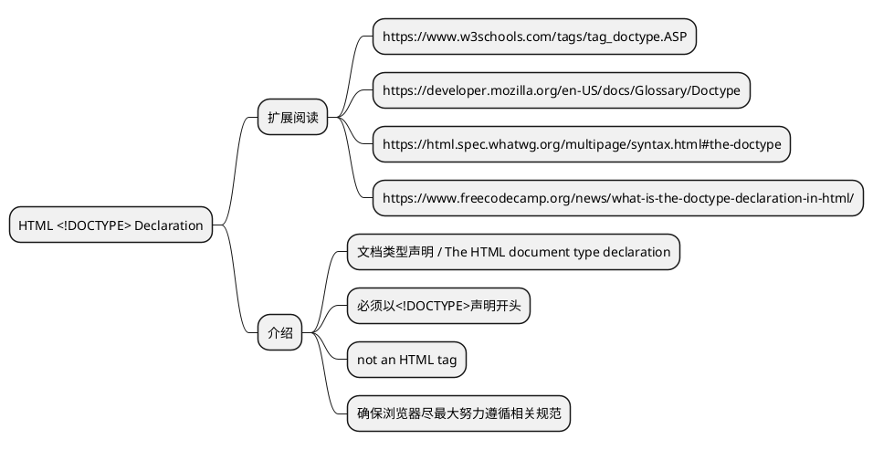
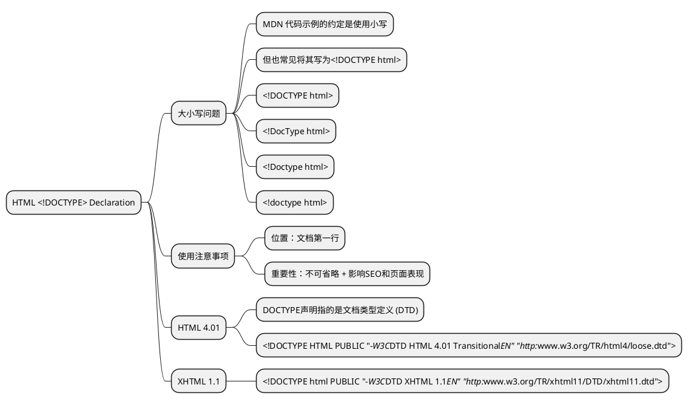

```html
<!doctype html>
```

---



---



---

- HTML 4.01 规定了三种文档类型：Strict、Transitional 以及 Frameset。
- XHTML 1.0 规定了三种 XML 文档类型：Strict、Transitional 以及 Frameset。

| 文档类型         | 作用                                                             |     |
| ---------------- | ---------------------------------------------------------------- | --- |
| Strict DTD       | 用于排除 W3C 预计随着 CSS 支持的增长而逐步淘汰的属性和元素的网页 |     |
| Transitional DTD | 用于包含W3C 预计随着 CSS 支持的增长而逐步淘汰的属性和元素的网页  |
| Frameset DTD     | 用于带有框架的网页                                               |

---

- Standards （标准）模式（也就是严格呈现模式）用于呈现遵循最新标准的网页，
- Quirks（包容）模式（也就是松散呈现模式或者兼容模式）用于呈现为传统浏览器而设计的网页。

|                       |                                              |     |
| --------------------- | -------------------------------------------- | --- |
| Full standards mode   | 完全标准模式根据 W3C Web 标准呈现页面        |     |
| Quirks 模式           | 以不符合标准的方式呈现页面                   |
| Almost standards mode | 接近于完全标准模式，但具有支持少量怪癖的功能 |
